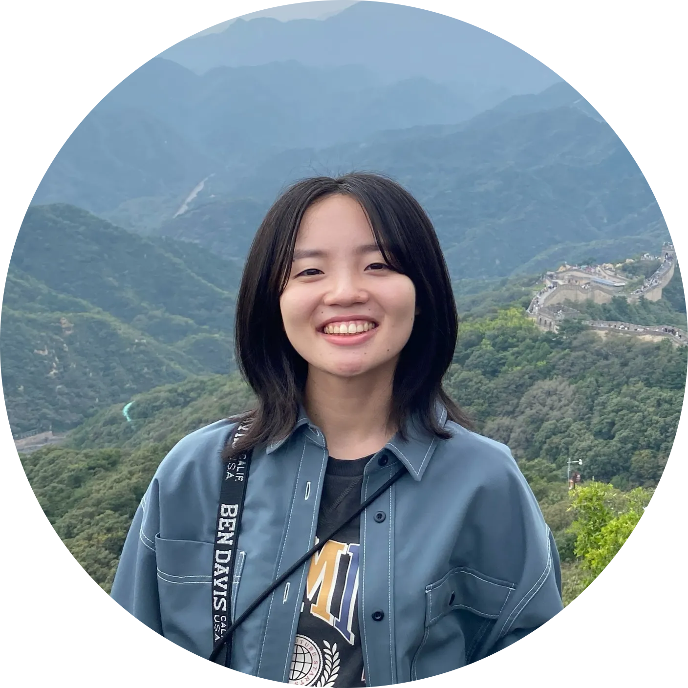

<nav class="side-nav">
  <a href="#profile">Profile</a>
  <a href="#publications">Publications</a>
  <a href="#education">Education</a>
  <a href="#experience">Research Experience</a>
  <a href="#awards">Awards</a>
  <a href="#funding">Funding</a>
  <a href="#skills">Skills</a>
  <a href="#hobbies">Hobbies</a>
  <a href="#contact">Contact</a>
</nav>

En/[Ja](index_ja.html)

  

  

    <h1>Yui Tatsumi</h1>

    

      <a href="https://github.com/qwert-top"><strong>Github</strong></a>　/　
      <a href="http://linkedin.com/in/qwert-top"><strong>Linkedin</strong></a>　/　
      <a href="https://scholar.google.com/citations?user=u1nK1wgAAAAJ"><strong>Google Scholar</strong></a>
    

    
<strong>Hi! I’m Yui Tatsumi, a Master’s student in Computer Science at Waseda University, Japan.</strong>

    

      My research interests include Artificial Intelligence, Computer Vision, and Signal Processing.
      I am working as a Research Assistant under Prof. Hiroshi Watanabe, primarily focusing on
      Neural Network-based Image Compression for Humans and Machines.
    

    

      I expect to complete my master course in Spring 2027 and am currently exploring industry
      research opportunities. Please feel free to reach out if you see a potential fit.
    

  

<h2 id="publications" class="section-heading">📚PUBLICATIONS</h2>

## Preprints

1. Ziyue Zeng, Xun Su, Haoyuan Liu, Bingyu Lu, **Yui Tatsumi**, Hiroshi Watanabe, “GVCC: Zero-Shot Video Compression via Codebook-Driven Stochastic Rectified Flow,” 2026.

### Peer-Reviewed Journal Papers

1. Takahiro Shindo, Taiju Watanabe, **Yui Tatsumi**, Hiroshi Watanabe, “Image Coding for Object Recognition Tasks Based on Contour Feature Learning with Flexible Object Selection,” **IEEE Access**, 2025.

### International Conference

1. Ziyue Zeng, **Yui Tatsumi**, Hiroshi Watanabe, “Flow Residual Segmentation and Generative Reconstruction for Motion-Aware Video Coding,” The 9th IIEEJ International Conference on Image Electronics and Visual Computing (**IEVC**), 2026. [to appear]
2. **Yui Tatsumi**, Ziyue Zeng, Hiroshi Watanabe, “Training-Free Adaptive Quantization for Variable Rate Image Coding for Machines,” IEEE 44th International Conference on Consumer Electronics (**ICCE**), 2026. [to appear]
3. Taiju Watanabe, Takahiro Shindo, **Yui Tatsumi**, Hiroshi Watanabe, “VFI-LoRA: Leveraging Video Diffusion Models for Video Interpolation Through LoRA Finetuning,” IEEE International Conference on Internet of Things and Intelligence System (**IoTaIS**), 2025.
4. **Yui Tatsumi**, Ziyue Zeng, Hiroshi Watanabe, “Seed Selection for Human-Oriented Image Reconstruction via Guided Diffusion,” IEEE 14th Global Conference on Consumer Electronics (**GCCE**), 2025.
5. Ziyue Zeng, **Yui Tatsumi**, Hiroshi Watanabe, “Bidirectional Attention-Gated Motion Injection for Frame Interpolation,” IEEE 14th Global Conference on Consumer Electronics (**GCCE**), 2025.
6. **Yui Tatsumi**, Ziyue Zeng, Hiroshi Watanabe, “Explicit Residual-Based Scalable Image Coding for Humans and Machines,” IEEE 27th International Workshop on Multimedia Signal Processing (**MMSP**), 2025.
7. Takahiro Shindo, **Yui Tatsumi**, Taiju Watanabe, Hiroshi Watanabe, “Guided Diffusion for the Extension of Machine Vision to Human Visual Perception,” IEEE 27th International Workshop on Multimedia Signal Processing (**MMSP**), 2025.
8. Takahiro Shindo, Taiju Watanabe, **Yui Tatsumi**, Hiroshi Watanabe, “Delta-ICM: Entropy Modeling with Delta Function for Learned Image Compression,” IEEE 43rd International Conference on Consumer Electronics (**ICCE**), 2025.
9. **Yui Tatsumi**, Shoko Tanaka, Shunsuke Akamatsu, Takahiro Shindo, Hiroshi Watanabe, “Classification in Japanese Sign Language Based on Dynamic Facial Expressions,” IEEE 13th Global Conference on Consumer Electronics (**GCCE**), 2024.
10. Shoko Tanaka, **Yui Tatsumi**, Takahiro Shindo, Hiroshi Watanabe, “Integrating QR Code Characteristics Into Super-Resolution Method,” IEEE 13th Global Conference on Consumer Electronics (**GCCE**), 2024.
11. Takahiro Shindo, **Yui Tatsumi**, Taiju Watanabe, Hiroshi Watanabe, “Refining Coded Image in Human Vision Layer Using CNN-Based Post-Processing,” IEEE 13th Global Conference on Consumer Electronics (**GCCE**), 2024.
12. Takahiro Shindo, Taiju Watanabe, **Yui Tatsumi**, Hiroshi Watanabe, “Scalable Image Coding for Humans and Machines Using Feature Fusion Network,” IEEE 26th International Workshop on Multimedia Signal Processing (**MMSP**), 2024.

### Domestic Conference, Japan

1. **Yui Tatsumi**, Ziyue Zeng, Hiroshi Watanabe, “Assessing the Effectiveness of Residual Information in Scalable Image Coding for Humans and Machines (in Japanese),” The 28th Meeting on Image Recognition and Understanding (MIRU), 2025.
2. Takahiro Shindo, Taiju Watanabe, **Yui Tatsumi**, Hiroshi Watanabe, “Evaluation of Face Recognition Accuracy in Decoded Images for Machine Vision (in Japanese),” The 87th National Convention of IPSJ, 2025.
3. Taiju Watanabe, Takahiro Shindo, **Yui Tatsumi**, Hiroshi Watanabe, “Video Frame Interpolation Using Pretrained Diffusion Model (in Japanese),” The 87th National Convention of IPSJ, 2025.
4. **Yui Tatsumi**, Takahiro Shindo, Taiju Watanabe, Hiroshi Watanabe, “Scalable Image Coding for Humans and Machines Using Feature Differences (in Japanese),” Picture Coding Symposium of Japan (PCSJ), 2024.
5. Takahiro Shindo, Taiju Watanabe, **Yui Tatsumi**, Hiroshi Watanabe, “Assessing the Effectiveness of ICM Method for Privacy Protection (in Japanese),” Picture Coding Symposium of Japan (PCSJ), 2024.
6. Taiju Watanabe, Takahiro Shindo, **Yui Tatsumi**, Hiroshi Watanabe, “Evaluation of Face Recognition Accuracy in Decoded Images for Machine Vision (in Japanese),” ITE Annual Convention, 2024.

<h2 id="education" class="section-heading">🏫EDUCATION</h2>

  

    
Apr. 2025 - Present

    

      
    

    

      <h3>Master of Engineering</h3>
      
<strong>Department of Computer Science and Communications Engineering, <a href="https://www.waseda.jp/top/en/">Waseda University</a></strong>

      
Supervisor: Prof. <a href="https://www.ams.giti.waseda.ac.jp/">Hiroshi Watanabe</a>

      
Topics: Image Compression for Humans/Machines

      <ul>
        <li>Conducting NICT commissioned research as a Research Assistant.</li>
      </ul>
    

  

  

    
Apr. 2021 - Mar. 2025

    

      
    

    

      <h3>Bachelor of Engineering</h3>
      
<strong>Department of Communications and Computer Engineering, <a href="https://www.waseda.jp/top/en/">Waseda University</a></strong>

      
GPA: 3.6/4.0 <strong>(top 5%)</strong>

      
Supervisor: Prof. <a href="https://www.ams.giti.waseda.ac.jp/">Hiroshi Watanabe</a>

      
Topics: Image Compression for Humans/Machines, Sign Language Recognition

      <ul>
        <li>Conducted NICT commissioned research as a Research Support Staff.</li>
        <li>Relevant Coursework: Computer Programming, Multimedia Systems, Software Engineering, Computer Architecture, Information Theory, Operating System, Signal Processing, and more.</li>
        <li>Published papers at international and domestic conferences such as <em>IEEE GCCE 2024</em> and <em>PCSJ/IMPS 2024</em>.</li>
      </ul>
    

  

  

    
Sep. 2018 - Mar. 2021

    

      
    

    

      <h3>International Christian University High School</h3>
      
GPA: 4.8/5.0

    

  

  

    
Oct. 2015 - Jun. 2018

    

      
HI

    

    

      <h3>Public School in Hawaii, U.S.</h3>
    

  

<h2 id="experience" class="section-heading">👔RESEARCH EXPERIENCE</h2>

  

    
Apr. 2025 - Mar. 2026

    

      
    

    

      <h3>Research Assistant at Waseda University</h3>
      
Research project commissioned by NICT, Grant No. 05101

      <ul>
        <li>Leading a research project commissioned by the National Institute of Information and Communications Technology (NICT), as a Research Assistant at Waseda University.</li>
        <li>Conducting research on Image Compression for Humans/Machines.</li>
      </ul>
    

  

  

    
Jan. 2026 - Jan. 2026

    

      
    

    

      <h3>Research Internship at Hitachi, Central Research Laboratory</h3>
      
R&amp;D Group

      <ul>
        <li>Conducted research on reliability enhancement and self-evolution technologies for AI agents.</li>
      </ul>
    

  

  

    
Aug. 2025 - Nov. 2025

    

      
    

    

      <h3>Research Scientist Internship at IBM Research - Tokyo</h3>
      
<strong>AI Automation</strong>

      <ul>
        <li>Conducted research and investigation on AI agents for compliance automation.</li>
      </ul>
    

  

  

    
Aug. 2025 - Sep. 2025

    

      
    

    

      <h3>R&amp;D Internship at Sansan</h3>
      
R&amp;D Automation Group

      <ul>
        <li>Conducted R&amp;D on business card digitization, focusing on improving the performance and automation rate of Viola, an in-house VLM developed at Sansan.</li>
      </ul>
    

  

  

    
Apr. 2024 - Mar. 2025

    

      
    

    

      <h3>Research Support Staff at Waseda University</h3>
      
Research project commissioned by NICT, Grant No. 05101

      <ul>
        <li>Led a research project commissioned by NICT, as a Research Support Staff at Waseda University.</li>
        <li>Conducted research on Scalable Image Compression for Humans and Machines.</li>
        <li>Published 8 papers at conferences such as IEEE MMSP 2024 as a commissioned research team from Waseda University.</li>
      </ul>
    

  

<h2 id="awards" class="section-heading">🏆ACADEMIC AWARDS</h2>

1. Oral Presentation Award, IEEE GCCE 2025 (2025)
2. Dean's award for students who have achieved excellence in research activities during their undergraduate years, **TOP 5%** in the Department of Communications and Computer Engineering, Waseda University (2025)
3. Oral Presentation Award, IEEE GCCE 2024 (2024)

<h2 id="funding" class="section-heading">💰RESEARCH FUNDING</h2>

- NICT (National Institute of Information and Communications Technology)
[ Commissioned research on information and communication technology ] number 05101

<h2 id="skills" class="section-heading">✨SKILLS</h2>

- Programming Language: Python / C / Java / JavaScript
- Frameworks and Application Tools: PyTorch, OpenCV
- Others: GitHub / Docker / Kubernetes
- Natural Language: Japanese (Native), English, Japanese Sign Language

<h2 id="hobbies" class="section-heading">💚HOBBIES</h2>

Traveling / Japanese Sign Language / Movies

<h2 id="contact" class="section-heading">✉️CONTACT</h2>

Email: **yui.t@fuji.waseda.jp**